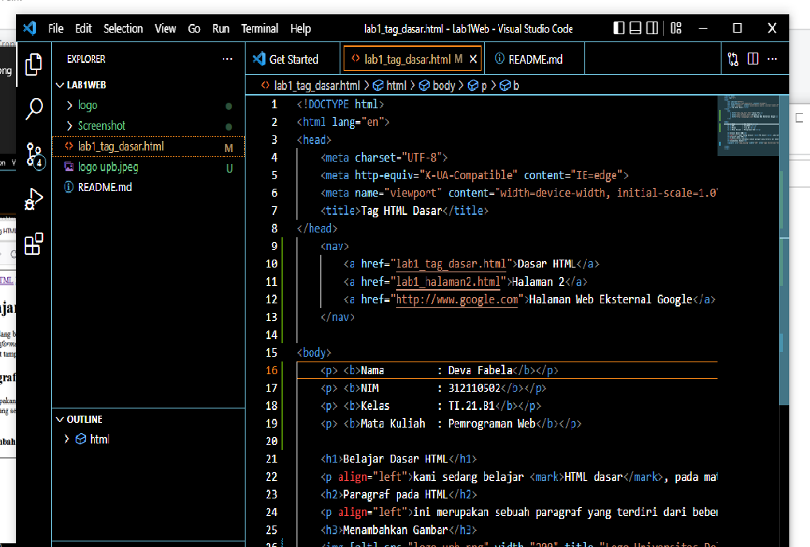
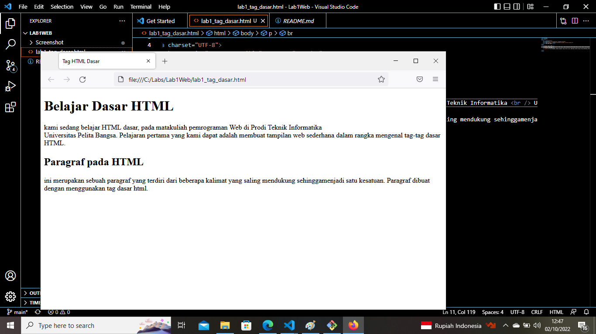
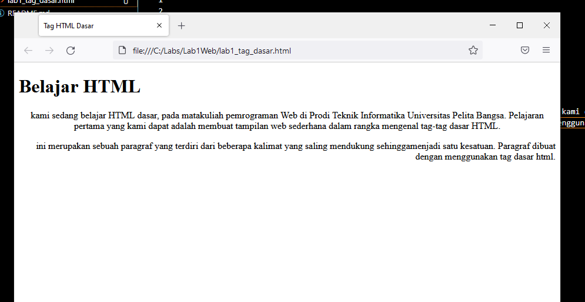
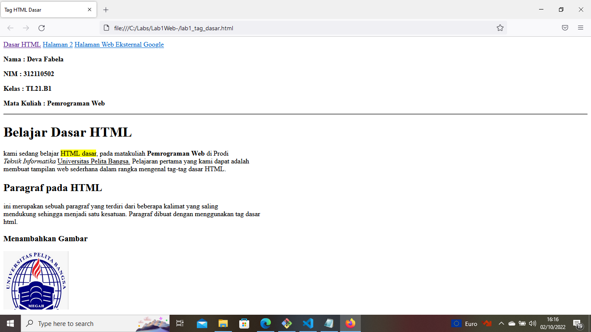

# Lab1Web-
## Belajar Tag Dasar HTML

### Langkah-langkah Membuat Paragraf
hsail code tag untuk pratikum dan membuat paragraf adalah 

ini adalah tampilannya

Menambahkan judul
ini adalah hasil dari menambakan judul yang menggunakan heading <h1> sampai <h6>

Memformat Teks
ini adalah hasil dari uji coba menggunakan forman align="right,left dan center" <b> bolt, <i> italic, dan lain-lain
 

Menyisipkan Gambar
ini adalah hasil dari 

Menambahkan hyperlink
<a href="lab1_tag_dasar.html">Dasar HTML</a> adalah code untuk menambahkan hyperlink 

Hasil dari Pratikum
ini adalah Hasil dari pratikum HTML saya

